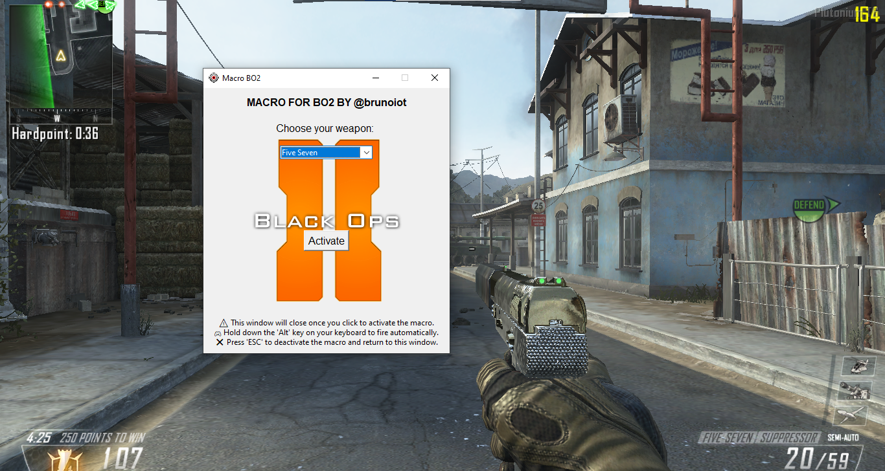
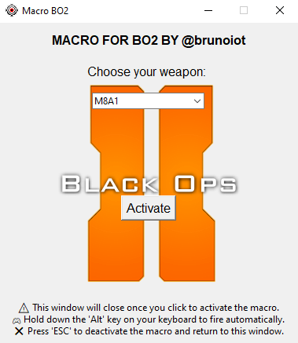

# Macro for Call of Duty: Black Ops 2

Welcome to the Macro for Call of Duty: Black Ops 2 project! This tool automates mouse clicks for semi-automatic or burst-fire weapons in the game, enhancing your gaming experience.

## Table of Contents

- [Getting Started](#getting-started)
- [Usage](#usage)
- [Instructions](#instructions)
- [Returning to the Interface](#returning-to-the-interface)
- [Exiting the Program](exiting-the-program)
- [Features](#features)
- [Support](#support)
- [License](#license)

## Getting Started

1. **Download**: Download the `macro-bo2.zip` file from the latest release on the [Releases](https://github.com/brunoiot/macro-bo2/releases) page.

2. **Unzip**: Unzip the downloaded file to a directory of your choice.

3. **Run**: Run the executable file (`macro-bo2.exe`).

## Usage

1. After launching `macro-bo2.exe`, a graphical interface will appear.

2. Choose your weapon from the available options.
3. Click the "Activate" button to activate the macro.
4. The interface window will close, and the macro will be active.

## Instructions

- Hold down the `Alt` key on your keyboard to engage automatic firing. The macro will repeatedly click the left mouse button, simulating rapid fire.
- Release the `Alt` key to stop firing.

## Returning to the Interface

- If you wish to access the interface again after activating the macro, simply press the `Esc` key.
- This will reopen the interface window, allowing you to make changes.

## Exiting the Program

- To completely close the program, simply close the interface window by clicking the close button (X) or using the window's close command.

## Features

- Automate mouse clicks for semi-automatic or burst-fire weapons.
- User-friendly graphical interface for selecting weapons.
- Ethical gaming practices and adherence to game guidelines.

## Support

For questions, feedback, or issues, feel free to reach out on the [Issues](https://github.com/brunoiot/macro-bo2/issues) page.

## License

This project is licensed under the [MIT License](LICENSE).

---

By using this macro tool responsibly, you can enhance your gameplay experience while maintaining fair and ethical gaming practices.

